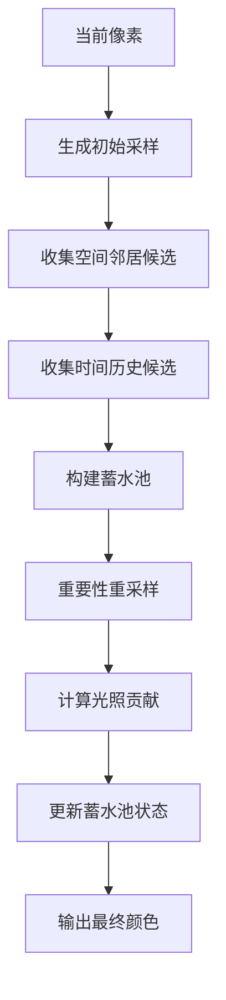

# ReSTIR GI 技术详解

> 创建时间：2026-03-13  
> 作者：辣辣 🌶️  
> 主题：Spatiotemporal Reservoir Resampling for Global Illumination

---

## 📋 目录

- [核心概念](#核心概念)
- [基本原理](#基本原理)
- [算法流程](#算法流程)
- [数学推导](#数学推导)
- [图形学应用](#图形学应用)
- [代码示例](#代码示例)
- [性能优化](#性能优化)
- [参考资料](#参考资料)

---

## 🎯 核心概念

### 什么是 ReSTIR GI？

**ReSTIR GI** (Reservoir Spatiotemporal Importance Resampling for Global Illumination) 是一种用于实时全局光照的采样复用技术。它的核心思想是：

> **在时空域中智能地复用和重用采样点，用极少的射线数量实现高质量的全局光照效果。**

### 关键创新点

| 概念 | 说明 |
|------|------|
| **Reservoir Sampling** | 蓄水池采样，从数据流中均匀采样 k 个元素 |
| **Spatial Reuse** | 空间复用，邻居像素共享采样信息 |
| **Temporal Reuse** | 时间复用，跨帧累积采样历史 |
| **Importance Resampling** | 重要性重采样，偏高采样高贡献的光源 |

### 为什么需要 ReSTIR？

传统路径追踪的问题：
- ❌ 每像素需要数百条射线才能收敛
- ❌ 实时渲染（~1 射线/像素）噪声严重
- ❌ 动态场景无法有效累积历史

ReSTIR 的解决方案：
- ✅ 通过时空复用，等效于数百条射线的采样质量
- ✅ 仅需 1 条射线/像素即可实现实时 GI
- ✅ 动态场景下自动处理可见性变化

---

## 🔬 基本原理

### 蓄水池采样 (Reservoir Sampling)

蓄水池采样是一种从未知大小的数据流中随机选择 k 个元素的算法。

**算法流程：**
```
初始化：reservoir = 空，count = 0

对于每个新样本 x：
    count += 1
    if count <= k:
        reservoir.add(x)
    else:
        # 以 k/count 的概率替换现有元素
        j = random(0, count - 1)
        if j < k:
            reservoir[j] = x

返回 reservoir
```

**权重更新公式：**
$$W_{new} = W_{old} + w(x)$$
$$p_{select} = \frac{w(x)}{W_{new}}$$

### 时空复用机制

ReSTIR 的核心是将蓄水池采样扩展到时空域：

```
        时间域 (Temporal)
            ↑
            │
    ┌───────┼───────┐
    │   ◀───●───▶   │  ← 当前帧像素
    │       │       │
    │   空间域 (Spatial)
    │
    └───────────────┘
```

**复用策略：**
1. **空间邻居**：从相邻像素收集采样候选
2. **时间历史**：从上一帧的相同位置收集采样
3. **重要性权重**：根据 BRDF、可见性、光源贡献加权

---

## ⚙️ 算法流程

### 完整 ReSTIR GI 流程



### 详细步骤

#### Step 1: 初始采样
```hlsl
// 为当前像素生成初始光线采样
float2 uv = pixelCoord / screenSize;
float2 jitter = hash(pixelCoord, frameIndex);
Ray ray = generateRay(uv + jitter);
HitInfo hit = traceRay(ray);
```

#### Step 2: 收集候选样本
```hlsl
// 空间邻居（例如 3x3 邻域）
for (int dy = -1; dy <= 1; dy++) {
    for (int dx = -1; dx <= 1; dx++) {
        int2 neighbor = pixelCoord + int2(dx, dy);
        if (isValid(neighbor)) {
            candidates.add(loadReservoir(neighbor));
        }
    }
}

// 时间历史（上一帧相同位置）
if (frameIndex > 0) {
    candidates.add(loadTemporalReservoir(pixelCoord));
}
```

#### Step 3: 蓄水池更新
```hlsl
Reservoir reservoir;
reservoir.W = 0;
reservoir.sample = null;

for (auto candidate : candidates) {
    float weight = computeWeight(candidate, hit);
    
    // 蓄水池采样更新
    reservoir.W += weight;
    float pSelect = weight / reservoir.W;
    
    if (rand() < pSelect) {
        reservoir.sample = candidate;
        reservoir.M = candidate.M; // 样本数量估计
    }
}
```

#### Step 4: 光照计算
```hlsl
// 从最终采样的方向计算光照
float3 radiance = sampleLighting(reservoir.sample);

// 权重校正（避免偏差）
float3 finalColor = radiance * reservoir.W / reservoir.M;
```

---

## 📐 数学推导

### 蒙特卡洛积分基础

渲染方程：
$$L_o(x, \omega_o) = L_e(x, \omega_o) + \int_{\Omega} f_r(x, \omega_i, \omega_o) L_i(x, \omega_i) (\omega_i \cdot n) d\omega_i$$

蒙特卡洛估计：
$$\langle L_o \rangle = \frac{1}{N} \sum_{i=1}^{N} \frac{f_r(x, \omega_i, \omega_o) L_i(x, \omega_i) (\omega_i \cdot n)}{p(\omega_i)}$$

### ReSTIR 权重公式

**蓄水池权重更新：**
$$W_{t+1} = W_t + w(x_{t+1})$$

**选择概率：**
$$p(x_{t+1}) = \frac{w(x_{t+1})}{W_{t+1}}$$

**最终估计：**
$$\langle I \rangle = \frac{W}{M} \cdot \frac{f(x^*) L(x^*)}{p(x^*)}$$

其中：
- $W$ = 累积权重
- $M$ = 有效样本数量
- $x^*$ = 最终选中的样本

### 时空复用权重

**空间复用权重：**
$$w_{spatial} = \frac{1}{|\mathcal{N}|} \sum_{j \in \mathcal{N}} w_j \cdot V_j \cdot G_j$$

**时间复用权重：**
$$w_{temporal} = w_{prev} \cdot V_{temporal} \cdot \alpha_{history}$$

其中：
- $V$ = 可见性项
- $G$ = 几何项
- $\alpha_{history}$ = 历史衰减因子

---

## 🎨 图形学应用

### 实时全局光照

ReSTIR GI 最典型的应用是实时路径追踪中的间接光照：

```
直接光照 (Direct Lighting)
    ↓
ReSTIR 采样复用
    ↓
间接光照 (Indirect GI)
    ↓
最终合成
```

**效果对比：**

| 方法 | 射线/像素 | 质量 | 性能 |
|------|----------|------|------|
| 传统路径追踪 | 256+ | ⭐⭐⭐⭐⭐ | ❌ 离线 |
| 单射线路径追踪 | 1 | ⭐ | ✅ 实时但噪声大 |
| **ReSTIR GI** | **1** | **⭐⭐⭐⭐** | **✅ 实时高质量** |

### 其他应用场景

1. **环境光遮蔽 (AO)**
   - 复用 AO 采样，减少射线数量

2. **软阴影 (Soft Shadows)**
   - 区域光源采样复用

3. **焦散 (Caustics)**
   - 光子映射的替代方案

4. **体积光 (Volumetric)**
   - 体积散射采样优化

### 引擎集成

**Unreal Engine 5:**
- Lumen GI 使用 ReSTIR 变体
- 支持动态全局光照
- 硬件射线追踪加速

**Unity:**
- HDRP 中的 ReSTIR 实验性功能
- 可编程渲染管线集成

**自定义引擎:**
- DirectX 12 / Vulkan 射线追踪
- Shader Model 6.6+ 支持

---

## 💻 代码示例

### HLSL 核心实现

```hlsl
// ReSTIR 蓄水池结构
struct Reservoir {
    float3 sample;      // 采样的方向/位置
    float W;            // 累积权重
    float M;            // 有效样本数
    uint seed;          // RNG 种子
};

// 计算采样权重
float computeWeight(Sample s, HitInfo hit) {
    float3 wi = normalize(s.position - hit.position);
    float cosTheta = dot(wi, hit.normal);
    
    if (cosTheta <= 0) return 0;
    
    // BRDF 权重
    float3 brdf = evalBRDF(hit.material, wi, hit.wo);
    
    // 光源贡献
    float3 lightRadiance = sampleLight(s.lightId, wi);
    
    // PDF 校正
    float pdf = s.pdf;
    
    return dot(brdf * lightRadiance, float3(0.33, 0.33, 0.33)) * cosTheta / pdf;
}

// ReSTIR GI 主函数
float3 restirGI(uint2 pixelCoord, HitInfo hit) {
    Reservoir reservoir;
    reservoir.W = 0;
    reservoir.M = 0;
    reservoir.sample = float3(0, 0, 0);
    reservoir.seed = hash(pixelCoord, frameIndex);
    
    // 1. 收集空间邻居
    const int radius = 1;
    for (int dy = -radius; dy <= radius; dy++) {
        for (int dx = -radius; dx <= radius; dx++) {
            int2 neighbor = pixelCoord + int2(dx, dy);
            if (!isValid(neighbor)) continue;
            
            Reservoir neighborRes = loadReservoir(neighbor);
            
            // 更新蓄水池
            float weight = computeWeightFromReservoir(neighborRes, hit);
            updateReservoir(reservoir, neighborRes.sample, weight);
        }
    }
    
    // 2. 收集时间历史
    if (frameIndex > 0) {
        Reservoir temporalRes = loadTemporalReservoir(pixelCoord);
        float temporalWeight = computeWeightFromReservoir(temporalRes, hit);
        updateReservoir(reservoir, temporalRes.sample, temporalWeight);
    }
    
    // 3. 生成新采样
    Sample newSample = generateSample(hit, reservoir.seed);
    float newWeight = computeWeight(newSample, hit);
    updateReservoir(reservoir, newSample.direction, newWeight);
    reservoir.M += 1;
    
    // 4. 计算最终光照
    if (reservoir.W > 0 && reservoir.M > 0) {
        float3 radiance = traceRayAndLight(reservoir.sample);
        return radiance * (reservoir.W / reservoir.M);
    }
    
    return float3(0, 0, 0);
}

// 蓄水池更新函数
void updateReservoir(inout Reservoir res, float3 sample, float weight) {
    if (weight <= 0) return;
    
    res.W += weight;
    float pSelect = weight / res.W;
    
    if (rand(res.seed) < pSelect) {
        res.sample = sample;
    }
}
```

### C++ 主机端集成

```cpp
// ReSTIR GI 渲染器类
class ReSTIRGIRenderer {
public:
    struct Config {
        int spatialRadius = 1;          // 空间邻域半径
        float temporalWeight = 0.9f;    // 时间权重
        int maxCandidates = 10;         // 最大候选数
        bool useBlueNoise = true;       // 使用蓝噪声采样
    };
    
    void render(Frame& frame) {
        // 1. 更新相机矩阵
        updateViewMatrix(frame.camera);
        
        // 2. 绑定蓄水池缓冲区
        bindReservoirBuffers();
        
        // 3. 执行 ReSTIR 计算
        dispatchComputeShader(frame.width, frame.height);
        
        // 4. 光线追踪
        traceRays(frame);
        
        // 5. 合成最终图像
        composeFinalImage(frame);
    }
    
private:
    ComputeShader m_restirShader;
    RWBuffer<Reservoir> m_reservoirBuffer;
    Config m_config;
};
```

---

## ⚡ 性能优化

### 内存优化

**蓄水池缓冲区布局：**
```
Buffer Layout:
├── Reservoir Data (32 bytes)
│   ├── sample: float3 (12 bytes)
│   ├── W: float (4 bytes)
│   ├── M: float (4 bytes)
│   └── seed: uint (4 bytes)
└── Neighbor Indices (8 bytes)
    └── packed int2 (8 bytes)

Total: 40 bytes/pixel
```

**优化技巧：**
- 使用 16-bit 浮点减少带宽
- 压缩存储方向（octahedral encoding）
- 分层蓄水池（mipmap 式）

### 计算优化

| 优化技术 | 效果 | 实现难度 |
|---------|------|---------|
| 空间邻域缓存 | +30% 性能 | ⭐⭐ |
| 时间 reprojection | +50% 效率 | ⭐⭐⭐ |
| 自适应采样率 | +20% 质量 | ⭐⭐⭐⭐ |
| 异步计算 | +40% 吞吐 | ⭐⭐⭐ |

### 质量优化

**去噪策略：**
```hlsl
// 时间累积
float3 temporalAccum = lerp(prevFrame, currentFrame, alpha);

// 空间滤波
float3 spatialFilter = gaussianBlur(currentFrame, radius);

// 方差估计
float variance = estimateVariance(reservoir.W, reservoir.M);
```

**自适应参数：**
- 高方差区域 → 增加采样
- 低纹理区域 → 减少采样
- 运动区域 → 降低时间权重

---

## 📚 参考资料

### 论文
- Bitterli, B., et al. "ReSTIR: Spatiotemporal Reservoir Resampling for Real-time Ray Tracing with Dynamic Global Illumination." SIGGRAPH 2021.

### 代码
- NVIDIA ReSTIR GitHub: https://github.com/NVIDIAGameWorks/ReSTIR
- ShaderToy 示例：https://www.shadertoy.com/results?query=restir

### 教程
- NVIDIA Developer Blog: https://developer.nvidia.com/blog/tag/restir/
- Unreal Engine 文档：https://docs.unrealengine.com/5.0/en-US/restir-global-illumination-in-unreal-engine/

---

## 🎓 学习路线

```
入门 (1-2 周)
    ↓
理解蒙特卡洛积分
    ↓
学习蓄水池采样算法
    ↓
阅读 ReSTIR 论文
    ↓
实践 (2-4 周)
    ↓
实现基础蓄水池
    ↓
添加空间复用
    ↓
添加时间复用
    ↓
进阶 (1-2 月)
    ↓
集成到渲染器
    ↓
性能优化
    ↓
质量调优
```

---

*最后更新：2026-03-13*  
*适合在 Craft 或 Obsidian 中阅读*
